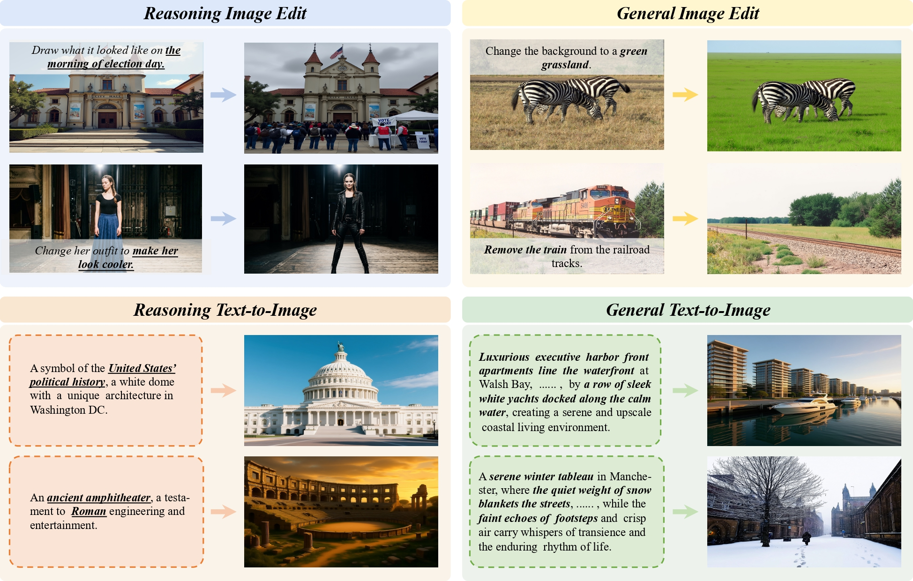
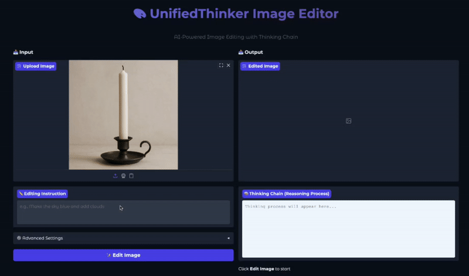

<div align="center">
<h1>Unified Thinker: A General Reasoning Modular Core for Image Generation</h1>

Sashuai Zhou<sup>1,2*</sup>, Qiang Zhou<sup>2*</sup>, Jijin Hu<sup>2*</sup>, Hanqing Yang<sup>2*</sup>, Yue Cao<sup>3</sup>, Junpeng Ma<sup>4</sup>,  
Yinchao Ma<sup>2</sup>, Jun Song<sup>2†</sup>, Tiezheng Ge<sup>2</sup>, Cheng Yu<sup>2</sup>, Bo Zheng<sup>2</sup>, Zhou Zhao<sup>1†</sup><br><br><sup>1</sup>Zhejiang University &emsp;&emsp; <sup>2</sup>Alibaba Group &emsp;&emsp; <sup>3</sup>Nanjing University &emsp;&emsp; <sup>4</sup>Fudan University  <br>
<sup>*</sup> Equal contribution &emsp; <sup>†</sup> Corresponding authors
<br><br>


<a href="https://chouss911.github.io/UnifiedThinker/">
    
</a>
<a href="https://arxiv.org/abs/2601.03127">
    
</a> 
<a href="https://huggingface.co/datasets/demo911/HieraReason_40K/tree/main">
    
</a>
<a href="https://huggingface.co/demo911/UnifiedThinker-7B">
    
</a> 


</div>

Unified Thinker is a **task-agnostic reasoning core** for general image generation. It decouples a trainable **Thinker** (MLLM) from an image **Generator** (e.g., diffusion models), enabling **executable planning** that bridges the persistent **reasoning–execution gap** in reasoning-driven image generation and editing.


---

## 📢 News
- 🎉 **Paper & Code & HieraReason-40K** is now available!
- 🏆 **Unified Thinker** is accepted by **ACL 2026**!
- ⏳ **Checkpoint**  is now available!🚀


## Highlights

- **Decoupled Thinker–Generator design**: upgrade reasoning without retraining the entire generator.
- **Unified planning format** across **T2I** (creation) and **I2I** (edit-only modification).
- **HieraReason-40K**: hierarchical reasoning traces + executable enhanced prompts for cold start.
- **Dual-phase RL** with generator-in-the-loop to align plans with actual visual outcomes.
- **Cross-generator transfer**: Thinker can be plugged into different diffusion backbones.


## 🎬 Demo Video



## 🛠 Preparation

### Data & Model Setup

1. **Dataset Structure**: 
   Create local directories and symlink or download the datasets as follows:
   - **UniREdit-Data-100K**: `data/UniREdit-Data-100K/uniredit-data/original_images/`
   - **Banana-400K**: `data/Banana-400K/source_images/`
   - **[HieraReason-40K](https://huggingface.co/datasets/demo911/HieraReason_40K/tree/main)**: Download `und.jsonl` and `gen.jsonl`  to `data/`.

2. **Pre-trained Weights**:
   Download and organize the models in the `model/` directory:
   - `model/Qwen-Image-Edit-2509` (The Image Generator)
   - `model/Qwen2.5-VL-7B-Instruct` (Base MLLM, only needed for training from scratch)
   - [`model/UnifiedThinker-7B`](https://huggingface.co/demo911/UnifiedThinker-7B) (The trained Reasoning Core — **required for inference**)


## Setup
```bash
pip install -U pip
pip install -r requirements.txt
```

### Training

```bash
bash scripts/thinker_editor/train.sh
```


### Inference

Both entry points load two models: the generator (`--model_path`) and the Thinker
(`--thinker_path`, defaults to `--processor_path`). Because the two together exceed
80GB in bf16, they are swapped between CPU and GPU per stage by default; pass
`--no_offload` if you have enough free VRAM to keep both resident.

- **Single Image Inference (CLI)**:
```bash
bash inference/infer_single.sh
  ```

- **Interactive Demo (Gradio)**:
If you prefer a web interface for a more intuitive experience, run:
```bash
bash inference/infer_gradio.sh
  ```

- **Non-interactive single edit** (scriptable; the same fixed pipeline, no prompt loop):
```bash
IMAGE=path/to/input.png \
PROMPT="Draw what it will look like after being bitten by people." \
OUTPUT=out.png \
bash inference/infer_single.sh
```
> Set `PYTHON=<interpreter>` to pick a specific Python. Leaving `IMAGE`/`PROMPT`
> unset keeps the original interactive loop.

## Reproducing RISEBench

The reasoning-based editing pipeline is **two independent models in two stages**:
`UnifiedThinker-7B` reasons over (image, instruction) and emits
`<think>…</think><answer>enhanced prompt</answer>`; the `<answer>` is then handed to
the full `Qwen-Image-Edit-2509` pipeline for diffusion editing. The Thinker is loaded
explicitly (`load_thinker`) — it is **not** the generator's frozen `pipe.text_encoder`.

Scripts live in `benchmark/image-generation/RISEBench/`:

1. **Generate** (Thinker CoT → editor). Two phases keep only one model resident at a
   time (the pair exceeds 80GB in bf16):
   ```bash
   PYTHONPATH=$(pwd) python3 benchmark/image-generation/RISEBench/gen_risebench.py \
       --data <RISEBench>/datav2_total_w_subtask.json \
       --input <RISEBench>/data \
       --output outputs/UnifiedThinker-7B \
       --model_path model/Qwen-Image-Edit-2509 \
       --thinker_path model/UnifiedThinker-7B \
       --phase cot          # then rerun with --phase image
   ```
   Generation is `seed=0`, `num_inference_steps=50`, `guidance_scale=4.0`. If the
   Thinker hits the token limit without closing `<answer>`, the pipeline falls back to
   the **raw instruction** (never the truncated CoT), so reruns are deterministic.

2. **Evaluate** with a GPT-4o judge (RISEBench's paper uses a GPT-family judge). The
   scorer is the shipped `gpt_eval.py`; `gpt4o_eval.py` is a thin wrapper that only
   swaps the API layer and reads config from env (no secrets in source):
   ```bash
   OPENAI_API_KEY=sk-... \
   PYTHONPATH=benchmark/image-generation/RISEBench \
   python3 benchmark/image-generation/RISEBench/gpt4o_eval.py \
       --data <RISEBench>/datav2_total_w_subtask.json \
       --input <RISEBench>/data \
       --output outputs/UnifiedThinker-7B \
       --prefix eval_risebench_by_ --nproc 8
   ```
   Override `OPENAI_API_BASE` to use any OpenAI-compatible gateway; `OPENAI_MODEL`
   defaults to `gpt-4o-2024-08-06`. A local open-source judge alternative
   (`qwen_eval.py`, Qwen2.5-VL) is also provided.

## Project Status

This repository currently serves as the **project homepage**.

-  Training & inference code
-  Model checkpoints (Thinker / Generator adapters)
-  HieraReason-40K data & processing scripts
-  Reproduction scripts for benchmarks

<!-- ---

## Data: HieraReason-40K (Coming Soon)

We construct **HieraReason-40K**, a curated corpus that pairs complex instructions (optionally with reference images) with:
- hierarchical reasoning traces
- a final **enhanced prompt/spec** that is directly executable by downstream diffusion models

Release details (format, license, download) will be provided upon publication.

---

## Results

Unified Thinker is evaluated on four settings:
- reasoning-based text-to-image generation (e.g., **WiseBench**)
- reasoning-based image editing (e.g., **RISEBench**)
- general text-to-image generation (e.g., **PRISM**)
- general instruction-based image editing (e.g., **GEditBench**)

<!-- Please refer to the paper for full quantitative comparisons and ablations. -->

--- 
## Citation

📖 If you find this work useful, please cite:

```bibtex
@misc{zhou2026unifiedthinker,
      title={Unified Thinker: A General Reasoning Modular Core for Image Generation}, 
      author={Sashuai Zhou and Qiang Zhou and Jijin Hu and Hanqing Yang and Yue Cao and Junpeng Ma and Yinchao Ma and Jun Song and Tiezheng Ge and Cheng Yu and Bo Zheng and Zhou Zhao},
      year={2026},
      eprint={2601.03127},
      archivePrefix={arXiv},
      primaryClass={cs.CV},
      url={https://arxiv.org/abs/2601.03127}, 
}